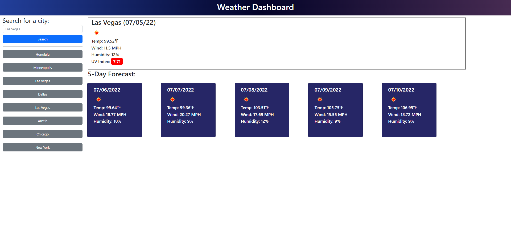

# weather_dashboard
**Note:** This repo contains my source code for a Weather Dashboard created as part of GA Tech's 2022 Coding Bootcamp.

## Description ##

Tired of having your parade rained on unexpectedly? Trying to get a few days notice for when an umbrella or sunblock will be necessary? Well you're in for a treat. This website is a simple to use, no-nonsense weather dashboard that will not only fetch you the current weather conditions for your desired location but also the 5 day forecast using the OpenWeather API. You will see the current temperature, wind speed, humidity, UV index, and even a handy icon that makes knowing the weather easy at a glance!

You may either choose from one of the preset cities or search for a city by name and let the magic happen! As you search the preset list will automatically be updated to include your most recent search results. Don't worry if you have to leave! Not only will the preset city list be saved with your eight most recent search terms but when you return the weather conditions and forecast for your most recent search will be automatically be loaded!

## Live Website ##

https://chromodyne.github.io/weather_dashboard/

## Screenshot ##

